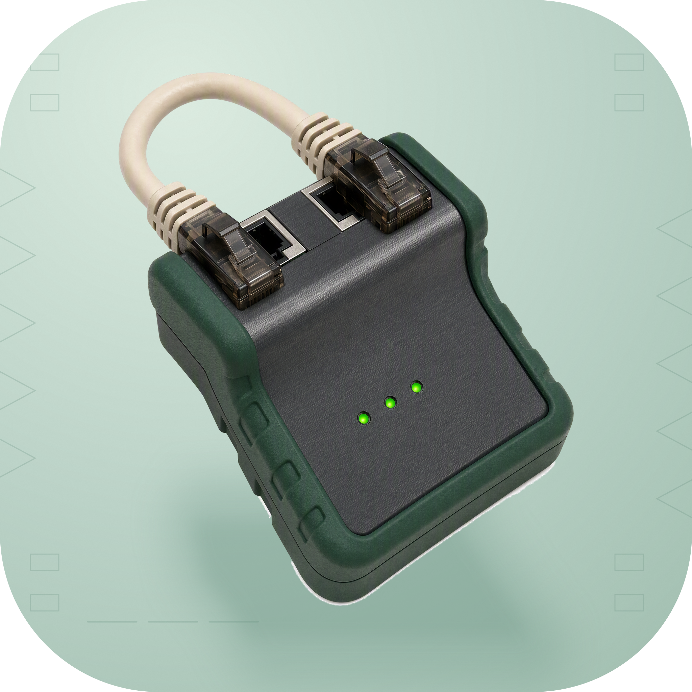

<p align="center">
  
</p>
<h1 align="center">IPSafe</h1>
<p align="center">Check an HTTP response before starting a command.</p>
<p align="center">
  <a href="../README.md">简体中文</a>
</p>

## What it does

IPSafe is a Node.js CLI that requests a configured URL and checks its HTTP status and, optionally, response content. It starts the command only after the check passes, and exits unsuccessfully when the check fails.

It adds a precondition to scripts that depend on a network service. The default checks whether `https://www.google.com` returns a 2xx response; you can use your own health endpoint. The check describes that request only. It does not continuously monitor the network while the command runs or automatically verify an exit IP, region, or proxy state.

## Features

- **HTTP conditions**: Check 2xx status and configure the request method, headers, timeout, and retries.
- **Content matching**: Use case-insensitive substring or regular-expression matching against the response.
- **Command execution**: Start the program after a successful check, stream its output, and optionally limit its runtime.
- **Project and user configuration**: Select a configuration file by priority or create a user-wide default.
- **JavaScript API**: Use `IpSafe`, `checkNetworkSafe`, and `executeIfSafe` from scripts.

## Usage

Requires Node.js. Install the CLI published on npm:

```bash
npm install -g ipsafe
ipsafe "node --version"
ipsafe "npm install"
```

See Development for running the source. The CLI returns exit code 1 when either the check or the child command fails.

### Configuration

```bash
ipsafe --init
ipsafe --config
ipsafe --config-path
ipsafe --help
```

`--init` creates user-wide configuration and refuses to overwrite an existing file by default. `--config` shows the configuration and search paths. `--config-path` prints the user-wide configuration path.

Configuration search order:

| Priority | Location |
| --- | --- |
| 1 | `ipsafe.config.json` in the current working directory |
| 2 | macOS / Linux: `$XDG_CONFIG_HOME/ipsafe/config.json`, or `~/.config/ipsafe/config.json` when unset |
| 2 | Windows: `%APPDATA%/ipsafe/config.json`, falling back to `AppData/Roaming` under the user directory |
| 3 | `~/.ipsafe.json` |
| 4 | Built-in defaults |

The first readable, valid file is merged with built-in defaults. Project and user files are not layered together. Invalid files produce a warning and the search continues.

Replace `testUrl` in this example with your own health endpoint:

```json
{
  "testUrl": "https://example.com/health",
  "timeout": 3000,
  "retries": 1,
  "method": "GET",
  "checkContent": true,
  "searchText": "ok",
  "searchType": "contains",
  "headers": {},
  "commandTimeout": 0
}
```

| Field | Meaning |
| --- | --- |
| `timeout` | Request timeout in milliseconds |
| `retries` | Retries after the initial request, with a one-second delay |
| `checkContent` / `searchText` | Enable response checking and provide the text or pattern |
| `searchType` | `contains` or `regex` |
| `headers` / `userAgent` | Custom check-request headers and User-Agent |
| `commandTimeout` | Command timeout in milliseconds; 0 means unlimited |

HTTP redirects are not followed automatically; a 3xx response fails the check. IP or region checks require a suitable endpoint and a content-matching rule you configure.

### Commands and script integration

Commands are parsed into a program and arguments and spawned directly. Invoke a shell explicitly when you need pipes or redirection, for example on macOS / Linux:

```bash
ipsafe 'sh -c "printf hello | wc -c"'
```

Recognized interactive programs such as `vim`, `less`, and `top` inherit the terminal. Delegate complex quoting and shell syntax to an explicitly invoked shell.

In JavaScript, `new IpSafe(configPath).run(args)` checks and executes using the configuration. `checkNetworkSafe(configPath)` returns only whether the check passed. `executeIfSafe(command, configPath)` returns a result with a `success` field, but currently does not forward the configured `commandTimeout` to the executor; use `IpSafe.run` when you need that timeout.

The repository also provides a standalone check script that prints `SAFE` or `UNSAFE` and returns the corresponding exit status:

```bash
node integrations/claude-code.js ./ipsafe.config.json
```

Other tools can call it, but you must connect it to their execution flow yourself.

## Development

Node.js 24 and Bun are recommended for development and tests:

```bash
git clone https://github.com/nocoo/ipsafe.git
cd ipsafe
bun install --frozen-lockfile
node bin/ipsafe.js --help
```

The current source uses CommonJS and Node.js built-in HTTP, HTTPS, filesystem, and child-process modules, with no third-party runtime dependencies.

## Tests

```bash
bun run test
bun run test:coverage
```

Tests cover configuration, HTTP conditions and retries, content matching, command parsing, and CLI branches using simulated network, filesystem, and child-process behavior. There is no separate browser or public-network integration test entry point. Check terminal interaction on the target operating system.

## Stack

| Technology | Role |
| --- | --- |
| JavaScript / Node.js | CLI and CommonJS API |
| node:http / node:https | HTTP checks before execution |
| node:child_process | Command execution, output, and signals |
| JSON / node:fs | Project and user configuration |
| Vitest | Unit tests and simulated CLI tests |

## Documentation

- [Default configuration example](../ipsafe.config.json)
- [Core check and execution code](../lib/ipsafe.js)
- [Standalone integration check](../integrations/claude-code.js)
- [Brand asset usage](01-logo-usage.md)

## License

[MIT](../LICENSE)
